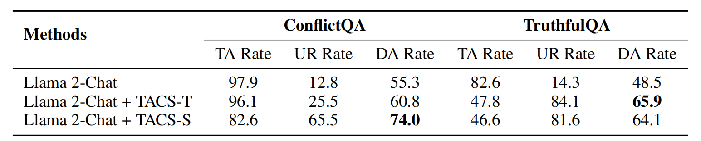

# Truth-Aware Context Selection: Mitigating the Hallucinations of Large Language Models Being Misled by Untruthful Contexts

> [Tian Yu](https://tianyu0313.github.io/), [Shaolei Zhang](https://zhangshaolei1998.github.io/), [Yang Feng](https://people.ucas.edu.cn/~yangfeng?language=en)*

Source code for paper "[Truth-Aware Context Selection: Mitigating the Hallucinations of Large Language Models Being Misled by Untruthful Contexts]()".

**Truth-Aware Context Selection (TACS)** is a method of selecting context based on its truthfulness, which discards the unreal parts of the context and retains the truthful parts, protecting the LLMs from being misled by untruthful context, thus avoiding the generation of hallucinations. TACS first performs truth detection on the context, and then constructs the corresponding attention mask according to the truthfulness of each position to filter the context. 

> [!Note]
> Experimental results shows that TACS can significantly alleviate the hallucination caused by untruthful context and improve the LLMs' adaptability in the face of information interference. More information can be found in the [paper]().

<div  align="center">   
  
</div>
<p align="center">
  Truthful information Acceptance Rate (TA Rate), Untruthful information Resistance Rate (UR Rate) and Disturbance Adaptation Rate on TruthfulQA and ConflictQA.
</p>


## 🔥 Models Download

We provide trained classifiers for truth detection! 

**TruthfulQA Truth Detection Classifiers**: [Classifiers for Llama 2-Chat-7B](https://). [Classifiers for Honest Llama](https://).

**ConflictQA Truth Detection Classifiers**: [Classifiers for Llama 2-Chat-7B](https://).

With these classifiers, TACS can perform truth (hallucination) detection on the contextual information based on the internal representations, evaluating the truthfulness of each location.

## Overview

- [Installation](#installation)
- [Quick Starts](#quick-starts)
- [TruthfulQA Evaluation](#truthfulqa-evaluation)
- [ConflictQA Evaluation](#conflictqa-evaluation)
- [Licence](#licence)
- [Citation](#citation)

## Installation

- Clone TACS's repo.

```bash
git clone https://github.com/ictnlp/TACS.git
cd TACS
export ROOT=pwd
```

- Environment requirements: Python 3.9, Pytorch 1.13.1.

```bash
pip install -r requirements.txt
```

## Quick Starts

- **GUI interaction**: We provide a GUI interface to intuitively compare the effect of TACS on LLM. You can click on the examples at the bottom of the page to quickly fill in the 'Question' and 'Information'. After clicking the 'Submit' button, you will see the results of the truth detection on the right, and get the results generated without (left-bottom) or using (right-bottom) TACS respectively.

<div  align="center">   
  
</div>


<p align="center">
 TACS firstly conduct truth detection on the contextual information, and then construct the corresponding attention mask according to the truthfulness of each position to filter the context.
</p>


> [!Tip]
> You can switch the truth detection granularity and adjust the classification threshold. Positions with scores above the threshold will be considered truthful.


To interact with TACS in your browser, you should firstly download the [truth detection classifiers] and place them at $ROOT/tfqa/svm, and then run the following command:

```bash
cd $ROOT/webui
CUDA_VISIBLE_DEVICES=0,1 python webui.py\
    --model_name ${path_to_Llama-2-7b-chat}\
    --token_svm_path ${path_to_token_level_classifier}\
    --token_svm_acc ${path_to_token_level_classifier_acc}\
    --sentence_svm_path ${path_to_sentence_level_classifier}\
    --sentence_svm_acc ${path_to_sentence_level_classifier_acc}\
    --TACS_mode 'DEMO_token'
```

## TruthfulQA Evaluation

### Generative Multiple-Choice

- Generate using Llama 2-Chat 7B with TACS
  - download [truth detection classifiers](), and save them to `$ROOT/tfqa/svm`
```shell
# Generation
cd $ROOT/tfqa
export model_path={path_to_llm}
export CUDA_VISIBLE_DEVICES=0,1,2,3

bash gmc_infer.sh
```
Generation results can be find at `$ROOT/tfqa/generative_multiple_choice_results`. Our generation results are also provided in [`./tfqa/generative_multiple_choice_results`](./tfqa/generative_multiple_choice_results).

- Evaluate using Llama 2-Chat 7B with TACS
```shell
# Evaluation
bash gmc_eval.sh
```
### Open-ended Generation

- Generate using Llama 2-Chat 7B with TACS

```shell
export model_path={path_to_llm}
export CUDA_VISIBLE_DEVICES=0,1,2,3

bash opg_infer.sh
```

Generation results can be find at `$ROOT/tfqa/open_ended_generation_results`. Our generation results are also provided in [`./tfqa/open_ended_generation_results`](./tfqa/open_ended_generation_results).

### Probabilistic Multiple-Choice

- Evaluate using Llama 2-Chat 7B with TACS

```shell
export model_path={path_to_llm}
export CUDA_VISIBLE_DEVICES=0,1,2,3

bash mc_eval.sh
```
Metrics can be find at [`./tfqa/probabilistic_multiple_choice_results`](./tfqa/probabilistic_multiple_choice_results) after running the above code.

## ConflictQA Evaluation
### Generative Multiple-Choice

- Generate using Llama 2-Chat 7B with TACS
  - download [truth detection classifiers](), and save them to `$ROOT/conflictqa/svm`
```shell
# Generation
cd $ROOT/conflictqa
export model_path={path_to_llm}
export CUDA_VISIBLE_DEVICES=0,1,2,3

bash infer.sh
```

Generation results can be find at `$ROOT/conflictqa/generative_multiple_choice_results`. Our generation results are also provided in [`./conflictqa/generative_multiple_choice_results`](./conflictqa/generative_multiple_choice_results).

- Evaluate using Llama 2-Chat 7B with TACS
```shell
# Evaluation
bash eval.sh
```

## Licence
Model weights and the inference code are released under The GNU General Public License v3.0 (GPLv3)

## Citation

If this repository is useful for you, please cite as:

```

```

If you have any questions, feel free to contact `yutian23s@ict.ac.cn`.
